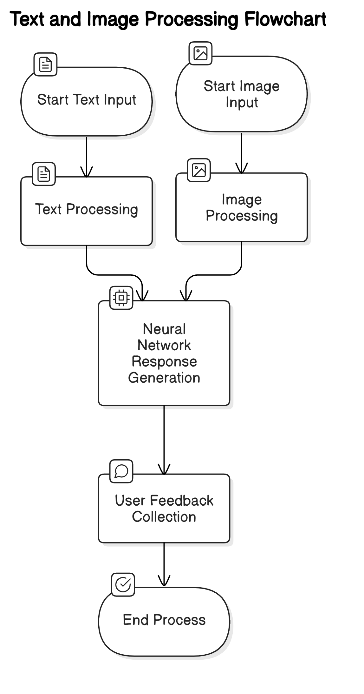

# Ассистент-Косметолог

"Ассистент-Косметолог" – интерактивное приложение, которое помогает пользователям получать персонализированные рекомендации по уходу за кожей, подбору косметических средств и определению типа кожи.

## О проекте

В условиях современной жизни уход за кожей требует индивидуального подхода. 
Наш Ассистент-Косметолог:
- Определяет тип кожи пользователя.
- Выявляет возможные проблемы (сухость, жирность, чувствительность, акне).
- Даёт рекомендации по подбору косметических средств, учитывая возраст, образ жизни и наличие аллергий.

Приложение использует технологии машинного обучения и генеративных моделей для обработки запросов, а также может анализировать изображения (при их загрузке) для получения дополнительной информации о состоянии кожи.

## Функциональность

- **Интерактивный диалог:** Пользователь вводит текстовый запрос и получает рекомендации от ассистента.
- **Обработка изображений:** Возможность загрузки изображения для автоматического описания с помощью модели vision.
- **История сообщений:** Сохранение и отображение диалога для контекстного взаимодействия.
- **Интеграция с Groq API:** Использование API для генерации ответов на основе комбинированных запросов (текст и описание изображения).

## Структура проекта

/tbank  <br>
├── data # векторезированная база и ее оригинал в csv<br>
├── model.py # Главный файл приложения Streamlit<br>
├── generate.py # Функции генерации ответов и описания изображений<br>
├── utils.py # Утилитарные функции (подсчёт токенов, обрезка истории и т.д.)<br>
├── requirements.txt # Список зависимостей<br>
├── vectirizer.py # ( экспериментально )<br>
└── README.md <br>

## Архитектура проекта




## Установка и запуск

1. **Клонируйте репозиторий:**
   ```bash
   git clone https://gitlab.atp-fivt.org/it-purple-hack/team66/tbank.git

   cd tbank

2. **Установите зависимости**
    ```bash
    pip install -r requirements.txt

3. **Запустите приложение**
    ```bash
    streamlit run model.py

## Как использовать

1. **Ввод запроса: В текстовом поле введите вопрос или запрос по уходу за кожей.**
2. **Загрузка изображения (опционально): Если хотите, загрузите фотографию для дополнительного анализа.**
3. **Получение рекомендаций: Нажмите кнопку "Получить рекомендации". Приложение обработает запрос и отобразит ответ ассистента.**
4. **История диалога: Все сообщения сохраняются и отображаются в виде диалога для удобного взаимодействия.**

## Гипотезы и результаты

В процессе разработки были выдвинуты и проверены следующие гипотезы:

1. **Векторизация базы данных:** Попытка векторизовать базу данных для подачи на вход модели оказалась слишком медленной. Это может быть связано с большим объемом данных или необходимостью оптимизации алгоритма.

2. **Подключение фотосканнера кожи:** Добавление загрузки фото кожи для анализа улучшило точность определения состояния кожи. Это подтвердило важность визуальных данных в процессе анализа.

3. **Создание эффективного промпта:** Разработка и тестирование различных промптов показали, что конечный вариант промпта дает лучшие результаты. Это подчеркивает важность точной формулировки запросов для улучшения качества ответов модели.

## Будущие улучшения

- Оптимизация процесса векторизации данных для повышения скорости обработки.
- Дальнейшее улучшение точности анализа изображений с помощью фотосканнера.
- Постоянное тестирование и улучшение промптов для получения более точных и релевантных ответов.

